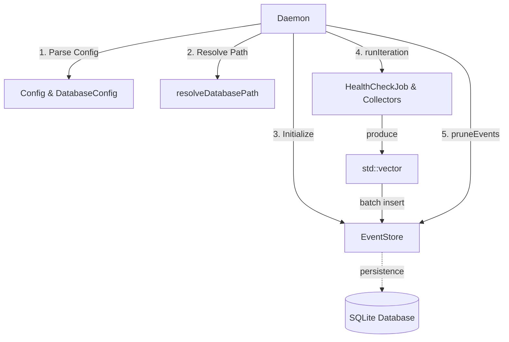
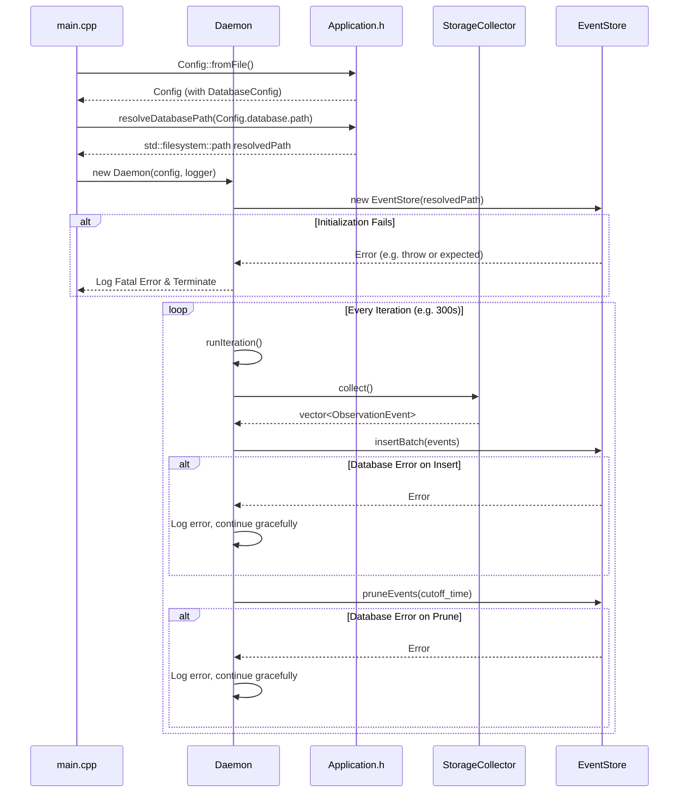

# Daemon EventStore Integration — Architecture Design Document

## 1. High-Level Component Architecture & Data Flow

The `daemon-eventstore-integration` feature bridges the `StorageCollector` (and any future collectors) with the `EventStore` persistence layer inside the main `Daemon` execution loop.

### 1.1 Architecture Graph



### 1.2 Sequence Diagram (Daemon Startup and Iteration)



## 2. Data Structures & API Changes

### 2.1 `Application.h` (Configuration)

We will introduce a new `DatabaseConfig` struct and update the main `Config` struct.

```cpp
namespace holonightd {

struct DatabaseConfig {
  std::optional<std::filesystem::path> path;
  std::optional<int> retention_days{30};
};

struct Config {
  // Existing fields...
  std::chrono::seconds interval{300};
  std::filesystem::path scan_root{"."};
  // ...

  // New field
  DatabaseConfig database;

  [[nodiscard]] static Config fromFile(const std::filesystem::path& path);
};

/// Resolves the final SQLite database file path using the XDG base directory specification.
[[nodiscard]] std::filesystem::path resolveDatabasePath(
    std::optional<std::filesystem::path> explicit_path = std::nullopt);

} // namespace holonightd
```

### 2.2 `Daemon.h`

The `Daemon` class will take ownership of an `EventStore` instance. Because database initialization might fail, and we want explicit control over lifecycle, `std::unique_ptr<EventStore>` is appropriate.

```cpp
namespace holonightd {

class Daemon {
 public:
  Daemon(Config config, Logger logger, bool debug = false);
  // ...

 private:
  void runIteration();

  Config config_;
  Logger logger_;
  bool debug_{false};
  LocalSummaryClient llmClient_;
  HealthCheckJob healthCheck_;

  // New members
  std::unique_ptr<EventStore> eventStore_;
  int retention_days_{30};
};

} // namespace holonightd
```

## 3. Error Handling Strategy

### 3.1 Fatal Startup Error
During the `Daemon` constructor (or immediately prior, in `main.cpp`), the application will attempt to create parent directories and initialize the `EventStore`. 
- If this fails (due to permissions, invalid path, or SQLite lock/corruption issues), the application will log a fatal error using `Logger::error()` and immediately terminate (either by throwing a `std::runtime_error` caught in `main()`, or by explicitly exiting).
- We must not enter the daemon execution loop without a functioning `EventStore`.

### 3.2 Iteration Fault Tolerance
Within `Daemon::runIteration()`, database operations (`insertBatch` and `pruneEvents`) may fail sporadically (e.g., SQLite `SQLITE_BUSY` or disk full). 
- If `eventStore_->insertBatch()` returns a `std::unexpected` string, the `Daemon` will catch this and log the error context using `Logger::error()`.
- If `eventStore_->pruneEvents()` fails, the same logging mechanism will apply.
- In both cases, the daemon loop **must not terminate** and no exception should be thrown that escapes `runIteration()`. The next scheduled interval will execute normally.

## 4. Key Architectural Decisions & Trade-offs

### 4.1 Trade-off: Embedded SQLite over External Database
- **Decision**: Use a local SQLite database accessed directly within the C++ daemon via `EventStore`.
- **Reasoning**: Maintains the "Zero GUI/Qt Dependencies" and lightweight architecture philosophy. Setting up PostgreSQL or external servers would introduce heavy deployment dependencies. SQLite provides sufficient concurrency and robustness for typical single-node automation.

### 4.2 Trade-off: Transactional Batch Inserts
- **Decision**: The `Daemon` collects all `ObservationEvent` objects from all collectors into a single `std::vector` and writes them using `EventStore::insertBatch()`.
- **Reasoning**: Calling `EventStore::insert()` individually for every event incurs significant I/O overhead because each statement opens a separate implicit transaction. A single batch transaction satisfies the REQ-NF-001 (50ms max overhead) performance requirement.

### 4.3 Alternative Considered: Asynchronous Database Thread
- **Alternative**: Offload database inserts and pruning to a separate thread with a message queue.
- **Why it was rejected**: It introduces complex thread synchronization (mutexes, condition variables) and queue management. SQLite batch inserts are extremely fast, well within the 50ms requirement for typical observation event volumes. The synchronous approach in `runIteration()` is simpler and fully compliant with the specification.

### 4.4 Known Risks
- **Filesystem Permissions**: The XDG Base Directory fallback might resolve to directories that exist but lack write permissions. The fatal startup error handling mitigates this by failing fast.
- **Disk Full**: A full disk will cause `insertBatch` to fail gracefully (logged but not crashing). However, pruning also requires SQLite space in some WAL configurations. The daemon will simply spin (logging errors) until space is freed.
