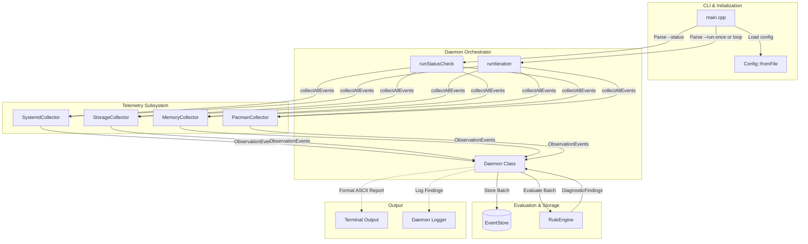
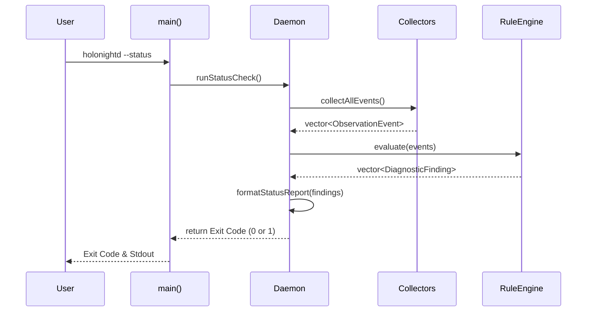

# Architectural Design: Daemon Integration & CLI Status Output (daemon-status-cli)

## 1. Executive Summary & Architectural Position

The `daemon-status-cli` feature integrates individual telemetry collectors (`SystemdCollector`, `StorageCollector`, `MemoryCollector`, `PacmanCollector`), the event persistence tier (`EventStore`), and the diagnostic rules engine (`RuleEngine`) into the core `Daemon` event loop of `holonightd`. 

Architecturally, this positions the `Daemon` class as the central orchestrator of the system's observability pipeline. Rather than having collectors run in isolation, they are now coordinated in synchronized batches. Furthermore, this feature introduces an on-demand diagnostic CLI entrypoint (`--status`), enabling users and external monitoring tools to retrieve a single-pass, aggregated health assessment without invoking the continuous daemon event loop. This fulfills a dual-purpose architecture: a persistent monitoring daemon and an interactive health diagnostic utility.

## 2. Component Architecture & Data Flow

### Component Diagram



### Sequence Diagram: CLI `--status` Invocation



## 3. Classes, Config Structures & API Changes

### `PacmanConfig` & `Config` Structure Updates
In `include/holonightd/Application.h`:
- Introduce `PacmanConfig` struct to represent configuration specific to `PacmanCollector` (paths, thresholds, boolean toggles).
- Add `PacmanConfig pacman;` and `std::optional<std::filesystem::path> rules_dir;` to the `Config` struct.
- `Config::fromFile()` is modified to parse `[pacman]` and `[rules]` sections from the TOML file.

### `CliOptions` Updates
In `include/holonightd/Application.h`:
- Extend `CliOptions` to include `bool status{false};`.
- Ensure the argument parser in `main.cpp` recognizes `--status`.

### `Daemon` Class API Additions
In `include/holonightd/Daemon.h`:
```cpp
class Daemon {
 public:
  // Existing constructor updated if needed
  Daemon(Config config, Logger logger, std::optional<std::filesystem::path> db_path = std::nullopt, bool debug = false);

  // New public entrypoint for the CLI
  [[nodiscard]] int runStatusCheck();

 private:
  // Core iteration step for the daemon loop
  void runIteration();

  // Helper to aggregate events from all configured collectors
  [[nodiscard]] std::vector<ObservationEvent> collectAllEvents();

  // Helper to format the console report
  std::string formatStatusReport(const std::vector<DiagnosticFinding>& findings) const;

  // New Members
  SystemdCollector systemdCollector_;
  StorageCollector storageCollector_;
  MemoryCollector memoryCollector_;
  PacmanCollector pacmanCollector_;
  RuleEngine ruleEngine_;
};
```

## 4. Algorithmic Breakdown

### Telemetry Collection Pipeline (`collectAllEvents()`)
1. Create a `std::vector<ObservationEvent>` with preallocated capacity to avoid reallocations.
2. Sequentially execute `collect()` on `systemdCollector_`, `storageCollector_`, `memoryCollector_`, and `pacmanCollector_`.
3. If an exception occurs in a collector, log the error using `logger_.error()`, but do **not** rethrow. Continue to the next collector.
4. Merge all successfully collected events into the single return vector.

### Diagnostic Evaluation & Findings Aggregation
1. Within `runIteration()` (loop) or `runStatusCheck()` (CLI):
2. Pass the aggregated `vector<ObservationEvent>` to `ruleEngine_.evaluate()`.
3. The `RuleEngine` returns a `vector<DiagnosticFinding>` matching the rules based on current telemetry.
4. If in loop mode, save events to `EventStore` and log findings to the daemon logger. If in status mode, proceed to formatting the terminal output.

### ASCII Terminal Status Report Rendering (`formatStatusReport`)
1. Create a `std::ostringstream`.
2. Write header and current UTC timestamp.
3. Determine "Overall Status" based on findings:
   - If findings contain `CRITICAL` or `ERROR` severity: `UNHEALTHY`.
   - Otherwise: `OK` or `WARNING`.
4. Iterate through `findings`, printing each:
   - Formatted severity `[CRITICAL]`, rule ID, and title.
   - List of matched events.
   - Bullet points for candidate root causes.
   - Bullet points for suggested remediation actions.
5. Append footer with finding count and corresponding exit code.
6. Convert stream to string and output to `std::cout`.

### Exit Code Resolution Logic
- **Exit Code 0**: No findings, or only `INFO`/`WARNING` level findings. Successful execution.
- **Exit Code 1**: At least one `ERROR` or `CRITICAL` finding is detected, or a catastrophic initialization error occurs (e.g., config parsing failure).

## 5. Error Handling & Exception Safety

- **Collector Isolation**: Since I/O failures (e.g., disk unreadable, D-Bus timeout) are common, the `collectAllEvents()` pipeline must catch exceptions from individual collectors. Failure in one collector must not crash the others nor abort the diagnostic report.
- **Daemon Loop Resilience**: `Daemon::run()` encapsulates `runIteration()` within a `try/catch` block. Unhandled exceptions trigger an error log but allow the daemon to sleep and attempt recovery on the next scheduled iteration.
- **Non-Throwing Report Formatting**: `formatStatusReport()` only performs string formatting and does not engage in I/O (beyond constructing the string representation). It is strictly exception-safe (assuming no `std::bad_alloc`). Outputting to `std::cout` is done carefully without throwing.

## 6. Architectural Decisions & Trade-offs

- **Direct Single-Pass vs RPC/D-Bus**:
  - *Decision*: `holonightd --status` spins up its own instances of the collectors to perform a direct diagnostic pass and exits, rather than connecting via RPC/D-Bus to query a running daemon.
  - *Trade-off*: Direct execution is significantly simpler to implement and avoids adding inter-process communication (IPC) dependencies. However, it means the `--status` command cannot retrieve historical state or events from memory buffers of the running daemon without reading the SQLite DB (which it currently doesn't query for active status). It only reflects instantaneous point-in-time state.
- **ASCII Report Styling**:
  - *Decision*: Simple structured text rather than JSON output or an interactive ncurses UI.
  - *Trade-off*: Maximizes readability for human operators without external tools like `jq`. A future enhancement may add `--output=json` for script automation if needed.

## 7. Alternatives Considered & Known Risks

- **Alternative 1: Threaded Collector Execution**:
  - Collecting from 4 sources concurrently could speed up `--status`.
  - *Discarded*: The C++23 standard library lacks high-level concurrency primitives like `std::jthread` task pools, and standard mutex management adds overhead. Given the non-functional requirement of < 2.0s execution time, sequential execution of local system calls is more than fast enough. Concurrency introduces unnecessary complexity.
- **Alternative 2: JSON Output for Status**:
  - Instead of ASCII output, output strict JSON.
  - *Discarded*: The primary user is a human administrator directly reading the terminal. JSON is too verbose for quick visual inspection.
- **Risk: Privilege Requirements**:
  - Some collectors (e.g. storage mounts, pacman lock files) may require root privileges. Running `--status` as a non-privileged user might yield partial data.
  - *Mitigation*: The exception isolation mechanism ensures that even if permissions are denied for one collector, the application fails gracefully, logging permission warnings and printing available data.
