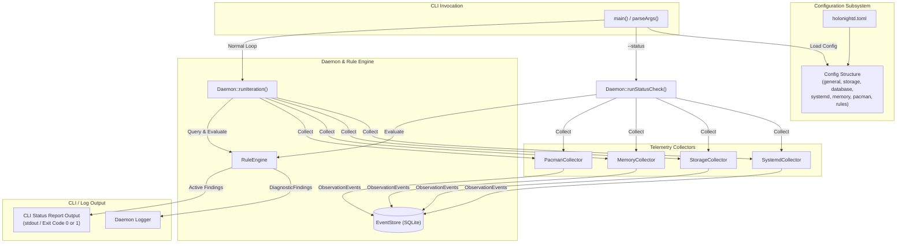

# Daemon Integration & CLI Status Output — EARS Specification

**Feature ID:** `daemon-status-cli`  
**Slug:** `daemon-status-cli`  
**Project:** holonightd (Linux daemon, C++23)  
**Header / Implementation:** `include/holonightd/Daemon.h`, `src/holonightd/Daemon.cpp`, `include/holonightd/Application.h`, `src/holonightd/Application.cpp`, `src/main.cpp`  
**Namespace:** `holonightd`  
**Date:** 2026-08-01  
**Phase:** 1.3 Daemon Pipeline Integration & CLI Status Interface  

---

## 1. Overview & Architecture

The `daemon-status-cli` feature integrates all Phase 1 telemetry collectors (`SystemdCollector`, `StorageCollector`, `MemoryCollector`, `PacmanCollector`), the SQLite event persistence store (`EventStore`), and the declarative rule evaluation engine (`RuleEngine`) into the core `Daemon` event loop. Additionally, it introduces the `--status` command-line flag and reporting subsystem, allowing users and automated maintenance scripts to perform on-demand system health checks and receive structured, human-readable terminal reports.



### Core Responsibilities
1. **Configuration Extensions:** Add `PacmanConfig` struct and `rules_dir` field to `Config`. Extend `Config::fromFile` to parse `[pacman]` and `[rules]` sections in TOML.
2. **Daemon Pipeline Integration:** Wire `SystemdCollector`, `StorageCollector`, `MemoryCollector`, `PacmanCollector`, and `RuleEngine` into `Daemon` as private instance members initialized with settings from `Config`.
3. **Continuous Diagnostic Iteration:** In `Daemon::runIteration()`, execute all 4 collectors, store emitted `ObservationEvent` batch in `EventStore`, evaluate events using `RuleEngine`, and log active `DiagnosticFinding` output.
4. **CLI `--status` Option:** Add `--status` flag to `CliOptions` and argument parsing in `main.cpp`.
5. **CLI Diagnostic Report:** Formats active findings into a structured, human-readable terminal report detailing active findings, severity levels, evidence events, candidate root causes, and suggested remediation actions. Exits `1` if critical or error findings exist, `0` otherwise.

### Non-Goals
- **Interactive TUI / GUI:** The `--status` report is a standard terminal text output (stdout), not an ncurses or interactive dashboard.
- **Direct Remediation Execution:** The status command outputs suggested remediation actions; it does not automatically execute system scripts or repair commands without explicit user intervention.
- **Persistent Loop in Status Mode:** Invoking `holonightd --status` performs a single diagnostic scan and exits immediately without running background threads or continuous event loops.

---

## 2. Data Structures & Configuration Extensions

### 2.1 C++ Configuration Extensions (`include/holonightd/Application.h`)

```cpp
namespace holonightd {

/// Configuration for PacmanCollector subsystem.
struct PacmanConfig {
  std::filesystem::path sys_root{"/"};
  std::filesystem::path db_path{"var/lib/pacman"};
  std::filesystem::path etc_path{"etc"};

  unsigned int max_depth{3};
  unsigned int warning_threshold{5};

  bool check_kernel{true};
  bool check_locks{true};
  bool check_orphans{true};
  bool check_transactions{true};
};

/// Updated Config structure containing all collector & rule engine options.
struct Config {
  std::chrono::seconds interval{300};
  std::filesystem::path scan_root{"."};
  std::vector<std::string> commands;

  double storage_warning_threshold{85.0};
  double storage_critical_threshold{95.0};
  std::vector<std::filesystem::path> storage_mount_points;

  std::optional<std::string> log_level;

  DatabaseConfig database;
  SystemdConfig systemd;
  MemoryConfig memory;
  PacmanConfig pacman;
  std::optional<std::filesystem::path> rules_dir;

  [[nodiscard]] static Config fromFile(const std::filesystem::path& path);
};

/// Command line options structure updated with status flag.
struct CliOptions {
  bool run_once{false};
  bool debug{false};
  bool status{false};
  std::optional<std::filesystem::path> config_path;
};

} // namespace holonightd
```

### 2.2 TOML Schema Extensions (`holonightd.toml`)

```toml
[pacman]
sys_root = "/"
db_path = "var/lib/pacman"
etc_path = "etc"
max_depth = 3
warning_threshold = 5
check_kernel = true
check_locks = true
check_orphans = true
check_transactions = true

[rules]
rules_dir = "/etc/holonight/rules"
```

### 2.3 Terminal Status Report Format

When executing `holonightd --status`, the output is rendered in human-readable ASCII format:

```text
================================================================================
                       holonightd System Status Report
================================================================================
Timestamp: 2026-08-01T22:00:00Z
Overall Status: UNHEALTHY (1 Critical, 1 Error)

--------------------------------------------------------------------------------
ACTIVE DIAGNOSTIC FINDINGS (2)
--------------------------------------------------------------------------------

[CRITICAL] RULE-STORAGE-001: Storage Space / Inode Pressure
  Category: storage
  Matched Events (1):
    - [storage] space_pressure on / (value: 96.5%)
  Candidate Root Causes:
    * Disk usage on / exceeded 95% threshold due to journal logs or cache growth.
  Suggested Remediation Actions:
    * action.storage.clean_journal_logs
    * action.storage.clean_pacman_cache

--------------------------------------------------------------------------------
[ERROR] RULE-PACMAN-001: Stale Pacman Database Lock
  Category: package
  Matched Events (1):
    - [pacman] stale_lock on /var/lib/pacman/db.lck (PID: 12345, dead)
  Candidate Root Causes:
    * Interrupted pacman transaction leaving orphan db.lck file.
  Suggested Remediation Actions:
    * action.pacman.remove_stale_lock

================================================================================
Summary: 2 findings detected across 4 system collectors. Exit Code: 1
================================================================================
```

---

## 3. Requirements & Acceptance Criteria

### 3.1 Functional Requirements (REQ-F)

#### REQ-F-001: Pacman Configuration Struct and Defaults
**Statement:** The `holonightd` application configuration shall provide a `PacmanConfig` structure containing system root, database path, etc path, scan depth, orphan warning threshold, and boolean flags for kernel, lock, orphan, and transaction checks.

**Acceptance criteria:**
- `PacmanConfig` defaults are `sys_root = "/"`, `db_path = "var/lib/pacman"`, `etc_path = "etc"`, `max_depth = 3`, `warning_threshold = 5`, `check_kernel = true`, `check_locks = true`, `check_orphans = true`, `check_transactions = true`.
- `Config` contains `pacman` (instance of `PacmanConfig`) and `rules_dir` (instance of `std::optional<std::filesystem::path>`).
- Structures are defined under namespace `holonightd` in `include/holonightd/Application.h`.

---

#### REQ-F-002: TOML Parsing for Pacman and Rules Configuration
**Statement:** When parsing a configuration TOML file, the `holonightd` `Config::fromFile` function shall populate `PacmanConfig` from `[pacman]` section fields and `rules_dir` from `[rules]` section fields.

**Acceptance criteria:**
- If `[pacman]` section exists in TOML, fields (`sys_root`, `db_path`, `etc_path`, `max_depth`, `warning_threshold`, `check_kernel`, `check_locks`, `check_orphans`, `check_transactions`) update `config.pacman`.
- If `[rules]` section exists and contains `rules_dir`, `config.rules_dir` is populated with the parsed string path.
- If `[pacman]` or `[rules]` sections are absent, default values are preserved without raising errors.

---

#### REQ-F-003: CLI Argument Parsing for `--status` Option
**Statement:** When parsing command line arguments, the `holonightd` CLI option parser shall recognize the `--status` option flag and set `CliOptions::status` to `true`.

**Acceptance criteria:**
- Invoking `parseArgs` with `--status` sets `options.status = true`.
- Usage output printed via `--help` or `-h` includes documentation for `--status`.
- Invalid or unknown command-line options continue throwing `std::runtime_error`.

---

#### REQ-F-004: Daemon Pipeline Collector Integration
**Statement:** The `holonightd` `Daemon` shall integrate `SystemdCollector`, `StorageCollector`, `MemoryCollector`, `PacmanCollector`, and `RuleEngine` as instance members configured from `Config`.

**Acceptance criteria:**
- `Daemon` constructor initializes all 4 collectors using their respective options derived from `Config` (`systemd`, `storage`, `memory`, `pacman`).
- If `config.rules_dir` is provided and exists, `Daemon` loads custom JSON rules from that directory into its `RuleEngine` instance in addition to default built-in rules.
- Collector objects are stored as private data members in `Daemon`.

---

#### REQ-F-005: Daemon Iteration Telemetry Collection & Event Persistence
**Statement:** When `Daemon::runIteration()` executes during a diagnostic cycle, the `holonightd` `Daemon` shall run all four telemetry collectors, persist emitted `ObservationEvent` objects into `EventStore`, and handle pruning according to retention policy.

**Acceptance criteria:**
- In `runIteration()`, `collect()` is called on `SystemdCollector`, `StorageCollector`, `MemoryCollector`, and `PacmanCollector`.
- All emitted events are combined into a single batch and passed to `EventStore::insertBatch()`.
- If capacity or age thresholds are met, database pruning (`pruneEventsByCapacity`, `pruneEventsByAge`) and WAL checkpointing (`checkpointWal`) are executed.
- The total count of collected observation events is recorded in debug/info log output.

---

#### REQ-F-006: Continuous Diagnostic Evaluation & Finding Logging
**Statement:** When `Daemon::runIteration()` completes event collection, the `holonightd` `Daemon` shall pass the collected events into `RuleEngine::evaluate()` and log all generated `DiagnosticFinding` instances.

**Acceptance criteria:**
- `RuleEngine::evaluate()` receives a span of collected `ObservationEvent` objects.
- Each generated `DiagnosticFinding` is logged via `Logger` with its title, severity, matched event count, candidate root causes, and suggested action IDs.
- Iteration completes cleanly without leaking resources or throwing exceptions.

---

#### REQ-F-007: CLI `--status` Diagnostic Execution and Reporting
**Statement:** Where `--status` is specified on the command line, the `holonightd` process shall execute a single telemetry collection and diagnostic evaluation pass, print a formatted human-readable status report to standard output, and exit without entering the daemon loop.

**Acceptance criteria:**
- Invoking `holonightd --status` collects metrics from all 4 collectors and evaluates them against `RuleEngine`.
- Formatted report is written to standard output (`std::cout`) matching the specification structure (header, timestamp, overall status, active findings list with title, severity, matched events, candidate causes, suggested actions, and summary).
- If any active finding has a severity of `Error` or `Critical`, the process exits with status code `1`.
- If no `Error` or `Critical` findings exist (only `Info`, `Warning`, or clean), the process exits with status code `0`.

---

#### REQ-F-008: Handling Collector and Query Failures during Status Check
**Statement:** If a telemetry collector or database query encounters an error during `--status` execution, then the `holonightd` application shall log the failure to stderr, output partial results for surviving collectors, and report overall execution failure with exit code 1.

**Acceptance criteria:**
- A failure in one collector (e.g. D-Bus connection error in `SystemdCollector`) does not prevent other collectors from running.
- Partial report includes findings generated by surviving collectors.
- Error message describing the collection failure is printed to standard error (`std::cerr`).
- Application returns exit code `1` due to incomplete status evaluation.

---

### 3.2 Non-Functional Requirements (REQ-NF)

#### REQ-NF-001: Execution Overhead for `--status` Invocation
**Statement:** When invoked with `--status`, the `holonightd` CLI execution shall complete all system collector scans and diagnostic report output within 2.0 seconds under standard operating conditions.

**Acceptance criteria:**
- Total execution time measured from main start to process exit is under 2.0 seconds.
- Memory usage during `--status` execution does not exceed 32 megabytes RSS.

---

#### REQ-NF-002: Exception Safety and Daemon Loop Resilience
**Statement:** While `Daemon::run()` is active in continuous loop mode, the `holonightd` daemon shall catch collector exceptions and continue subsequent scheduled iterations without process termination.

**Acceptance criteria:**
- Exceptions thrown during a single `runIteration()` step are caught and logged as errors.
- The main daemon loop sleeps for `config.interval` and continues to the next scheduled iteration.
- Process does not crash on temporary system I/O or filesystem permission failures.

---

#### REQ-NF-003: Terminal Report Readability and Formatting
**Statement:** The `holonightd` CLI status output shall format diagnostic report sections using distinct ASCII section headers, aligned key-value attributes, and clear bullet points for candidate causes and suggested actions.

**Acceptance criteria:**
- Output fits within standard 80-column terminal width.
- Sections are delimited by clear ASCII separators (`===` and `---`).
- Severity levels are prefixed with uppercase tags (`[CRITICAL]`, `[ERROR]`, `[WARNING]`, `[INFO]`).

---

### 3.3 Constraints (REQ-C)

#### REQ-C-001: Modern C++23 Language Standard Conformance
**Statement:** The `holonightd` daemon integration and status CLI implementation shall conform strictly to C++23 standard (`-std=c++23`) using standard library features and zero raw owning pointers.

**Acceptance criteria:**
- Code builds cleanly with GCC 13+ / Clang 16+ on C++23 standard flags (`-std=c++23`).
- Compiler flags `-Wall -Wextra -Werror` pass without any warnings.

---

#### REQ-C-002: Static Analysis and Test Suite Validation
**Statement:** All code added for `daemon-status-cli` shall pass `task format-check`, `task tidy-src`, and `task test` without warnings or failures.

**Acceptance criteria:**
- `task format-check` reports no formatting diffs.
- `task tidy-src` passes with zero static analysis warnings.
- `task test` executes unit tests covering configuration parsing, CLI argument parsing, daemon pipeline integration, and status reporting with 100% pass rate.

---

## 4. Header & Implementation Sketches

### 4.1 `include/holonightd/Daemon.h` Sketch

```cpp
#pragma once

#include "holonightd/Application.h"
#include "holonightd/EventStore.h"
#include "holonightd/HealthCheckJob.h"
#include "holonightd/LlmClient.h"
#include "holonightd/Logger.h"
#include "holonightd/MemoryCollector.h"
#include "holonightd/ObservationEvent.h"
#include "holonightd/PacmanCollector.h"
#include "holonightd/RuleEngine.h"
#include "holonightd/StorageCollector.h"
#include "holonightd/SystemdCollector.h"

#include <atomic>
#include <cstdint>
#include <filesystem>
#include <memory>
#include <optional>
#include <vector>

namespace holonightd {

enum class RunMode : std::uint8_t { Loop, Once };

class Daemon {
 public:
  Daemon(Config config, Logger logger, std::optional<std::filesystem::path> db_path = std::nullopt, bool debug = false);

  void run(const std::atomic_bool& stopRequested, RunMode mode);

  /// Executes a single diagnostic pass and outputs status report to stdout.
  /// Returns exit code 1 if critical/error findings exist, 0 otherwise.
  [[nodiscard]] int runStatusCheck();

 private:
  void runIteration();
  [[nodiscard]] std::vector<ObservationEvent> collectAllEvents();

  Config config_;
  Logger logger_;
  bool debug_{false};
  LocalSummaryClient llmClient_;
  HealthCheckJob healthCheck_;
  
  SystemdCollector systemdCollector_;
  StorageCollector storageCollector_;
  MemoryCollector memoryCollector_;
  PacmanCollector pacmanCollector_;
  RuleEngine ruleEngine_;

  std::unique_ptr<EventStore> eventStore_;
  int retention_days_{30};
};

}  // namespace holonightd
```

### 4.2 Entrypoint Flow Sketch (`src/main.cpp`)

```cpp
int main(int argc, char** argv) {
  std::signal(SIGINT, handleSignal);
  std::signal(SIGTERM, handleSignal);

  try {
    const auto options = parseArgs(argc, argv);
    const auto config_path = holonightd::resolveConfigPath(options.config_path);
    auto config = holonightd::Config::fromFile(config_path);
    const auto log_level = holonightd::resolveLogLevel(options, config);
    holonightd::Logger logger{log_level, options.debug};

    const auto db_path = holonightd::resolveDatabasePath(config.database.path);
    holonightd::Daemon daemon{std::move(config), logger, db_path, options.debug};

    if (options.status) {
      return daemon.runStatusCheck();
    }

    daemon.run(stopSignal(), options.run_once ? holonightd::RunMode::Once : holonightd::RunMode::Loop);
  } catch (const std::exception& error) {
    std::cerr << "ERROR: " << error.what() << '\n';
    printUsage(std::cerr);
    return 1;
  }

  return 0;
}
```
