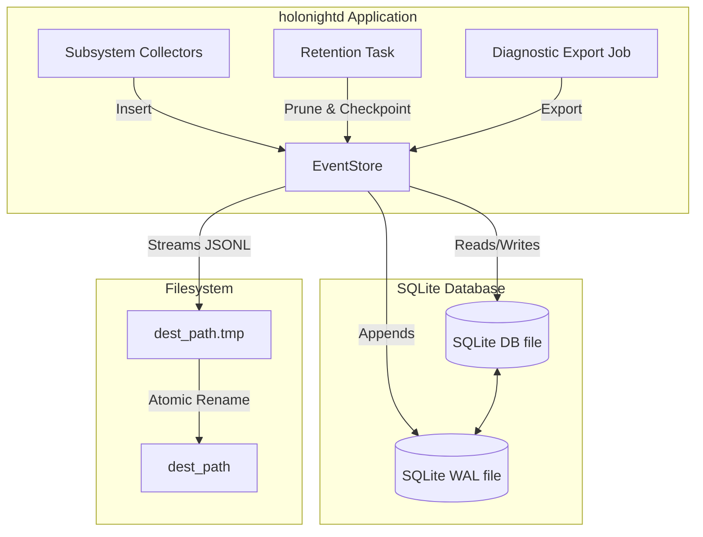
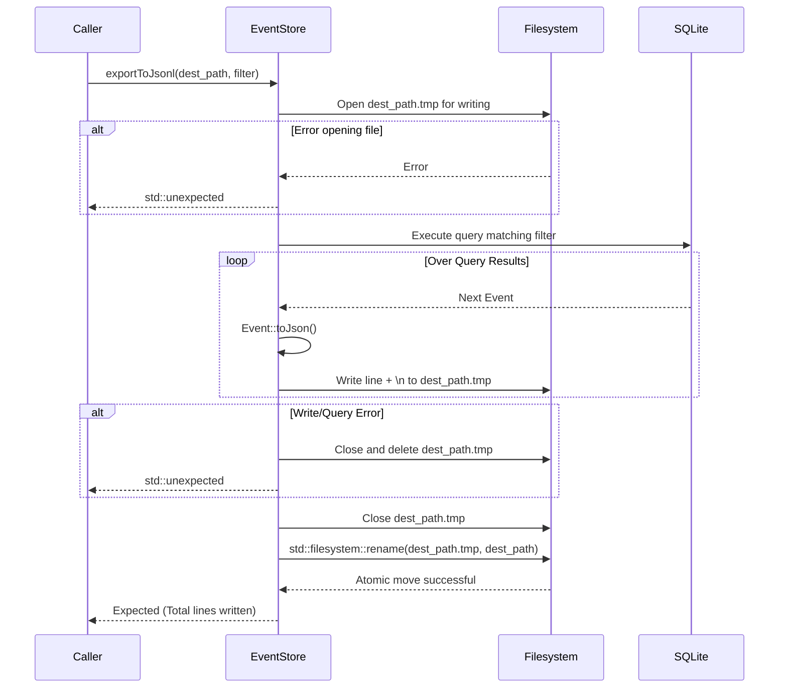

# Architecture Design: EventStore Storage Management & Export

**Feature ID:** `eventstore-retention-export`  
**Phase:** SDD Stage 2 - Architecture Design  

---

## 1. High-Level Component Architecture & Data Flow

The `EventStore` acts as a central sink for all diagnostic observations generated by `holonightd` subsystem collectors. To prevent infinite storage consumption, a retention policy is introduced, consisting of age-based and capacity-based pruning strategies, along with SQLite Write-Ahead Log (WAL) checkpointing. Additionally, a JSONL export feature allows operators to extract diagnostic events in a machine-readable format.

The flow operates as follows:
- **Pruning**: Periodic tasks trigger `EventStore::pruneEventsByAge` and `EventStore::pruneEventsByCapacity`. Capacity pruning relies on database size or row counts exceeding limits, shrinking them to 90% via severity-ordered deletion.
- **Checkpointing**: Following pruning, or on a scheduled basis, `EventStore::checkpointWal()` truncates the SQLite WAL file, ensuring disk space reclaimed by deletions is reflected on disk, preventing endless WAL growth.
- **Exporting**: An external trigger or daemon job initiates `EventStore::exportToJsonl()`. This method queries events, streams them line-by-line as JSON to a `.tmp` file, and upon success, atomically renames the file to the final destination.

---

## 2. Mermaid Diagrams

### 2.1 Storage Management & Export Data Flow



### 2.2 Capacity Pruning Loop

```mermaid
sequenceDiagram
    participant Caller
    participant EventStore
    participant SQLite

    Caller->>EventStore: pruneEventsByAge(cutoff)
    EventStore->>SQLite: DELETE FROM observation_events WHERE timestamp < cutoff
    SQLite-->>EventStore: Deleted count
    EventStore-->>Caller: Result

    Caller->>EventStore: pruneEventsByCapacity(max_bytes, max_events)
    EventStore->>SQLite: PRAGMA page_count, page_size; SELECT count(*)
    SQLite-->>EventStore: db_size, event_count

    alt db_size > max_bytes OR event_count > max_events
        EventStore->>EventStore: Calculate target size (90%)
        EventStore->>SQLite: DELETE FROM observation_events ORDER BY severity ASC, timestamp ASC LIMIT ...
        SQLite-->>EventStore: Deleted count
    end
    EventStore-->>Caller: Total Deleted count

    Caller->>EventStore: checkpointWal()
    EventStore->>SQLite: PRAGMA wal_checkpoint(TRUNCATE)
    SQLite-->>EventStore: Success (WAL truncated)
    EventStore-->>Caller: Result
```

### 2.3 Atomic JSONL Export Flow



---

## 3. Interfaces, Method Signatures & Data Structures

### 3.1 `DatabaseConfig` in `Application.h`
```cpp
namespace holonightd {

struct DatabaseConfig {
  std::optional<std::filesystem::path> path;
  std::optional<int> retention_days{30};
  
  // New configuration options for capacity retention
  std::optional<size_t> max_bytes{52428800}; // Default 50 MB
  std::optional<size_t> max_events{100000};  // Default 100,000 events
};

} // namespace holonightd
```

### 3.2 `EventStore` in `EventStore.h`
```cpp
namespace holonightd {

class EventStore {
 public:
  // ... existing methods ...

  /// Deletes observation events older than the specified time point. (Existing, updated signature if needed, or already present)
  [[nodiscard]] std::expected<size_t, std::string> pruneEventsByAge(std::chrono::system_clock::time_point older_than);

  /// Prunes events to 90% of capacity limits if thresholds are exceeded.
  /// Evicts lowest severity and oldest events first.
  [[nodiscard]] std::expected<size_t, std::string> pruneEventsByCapacity(size_t max_bytes, size_t max_events);

  /// Executes PRAGMA wal_checkpoint(TRUNCATE) to commit WAL to DB and truncate WAL file size.
  [[nodiscard]] std::expected<void, std::string> checkpointWal();

  /// Exports events matching the filter to a JSONL file atomically.
  [[nodiscard]] std::expected<size_t, std::string> exportToJsonl(const std::filesystem::path& dest_path, const EventQuery& filter);
};

} // namespace holonightd
```

### 3.3 SQL Queries & Indexing Strategies

**Indexes:**
To optimize capacity pruning, a composite index should be present or added to `EventStore::Impl` schema initialization:
```sql
CREATE INDEX IF NOT EXISTS idx_severity_timestamp ON observation_events (severity ASC, timestamp ASC);
```

**Capacity Check Query:**
```sql
PRAGMA page_count;
PRAGMA page_size;
SELECT count(*) FROM observation_events;
```

**Pruning Query (Severity-First):**
```sql
DELETE FROM observation_events WHERE id IN (
  SELECT id FROM observation_events 
  ORDER BY severity ASC, timestamp ASC 
  LIMIT ?
);
```

---

## 4. Key Architectural Decisions & Rationale

1. **90% Target Capacity Hysteresis:**
   - *Decision:* When max limits are hit, prune back to 90% rather than 100%.
   - *Rationale:* If we pruned to exactly 100%, every single subsequent event insertion would re-trigger the pruning mechanism, causing thrashing and expensive SQL `DELETE` operations on every write. A 90% target creates a buffer (hysteresis loop) allowing batch inserts before another prune is necessary.

2. **Severity-First Pruning vs FIFO:**
   - *Decision:* Capacity pruning deletes lowest severity events (`Debug`, `Info`) first, then older events within the same tier.
   - *Rationale:* Diagnostic daemons generate high volumes of low-value `Debug` logs. When storage is constrained, preserving `Critical` and `Error` events is paramount for debugging. Standard FIFO would drop critical signals merely because they were preceded by a burst of debug noise.

3. **Atomic Rename Pattern (`.tmp` file):**
   - *Decision:* `exportToJsonl` writes to a `.tmp` file and uses `std::filesystem::rename` upon success.
   - *Rationale:* Ensures crash resilience. If the daemon crashes, the query fails, or the disk fills up during export, the final `dest_path` is never corrupted with a partial JSONL file. Readers monitoring the output directory only see the final, complete file.

4. **SQLite `PRAGMA wal_checkpoint(TRUNCATE)`:**
   - *Decision:* Add an explicit method to force WAL truncation.
   - *Rationale:* SQLite WAL mode allows high-concurrency writes but the `-wal` file can grow indefinitely if not properly checkpointed, especially with large batch deletes (pruning). Truncating ensures disk space is genuinely returned to the OS.

---

## 5. Alternatives Considered & Known Risks

1. **In-Memory Event Buffer vs SQLite WAL:**
   - *Alternative:* Buffer events in RAM and periodically flush to a static JSON/CSV.
   - *Why rejected:* Fails to provide crash durability across daemon restarts and lacks a robust query language for flexible pruning and filtering. SQLite WAL is battle-tested.

2. **Full DB `VACUUM` vs `PRAGMA wal_checkpoint`:**
   - *Alternative:* Use `VACUUM` to rebuild the entire database to reclaim fragmented space inside the `.db` file.
   - *Why rejected:* `VACUUM` requires significant temporary disk space (double the DB size) and locks the database exclusively, halting all background logging. WAL checkpointing is fast, non-blocking, and reclaims WAL file disk space efficiently.

3. **Loading All into Memory vs Streaming JSONL:**
   - *Alternative:* Load `std::vector<ObservationEvent>` via `query()` and iterate to generate the file.
   - *Why rejected:* With `max_events` up to 100,000, loading all events into RAM might cause OOM kills on memory-constrained IoT/embedded Linux hosts. Streaming directly from an active SQLite prepared statement to a `std::ofstream` is O(1) in memory usage.

---
