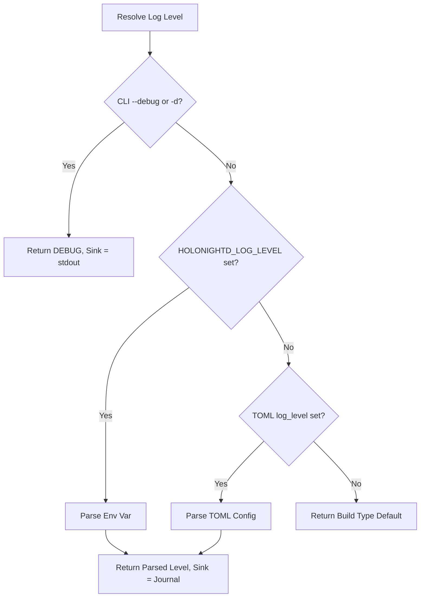
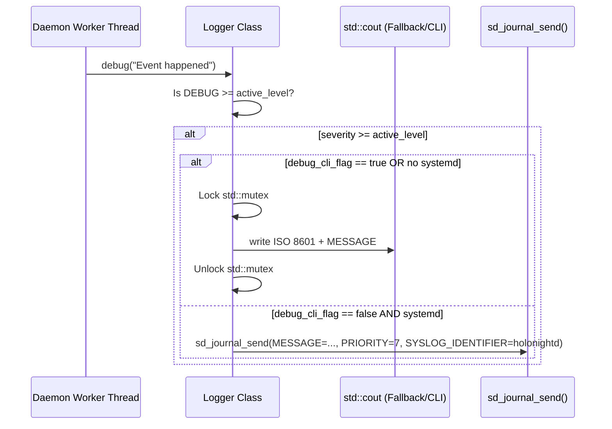

# Journal Logging System — Architecture Design

**Feature ID:** `journal-logging`  
**Project:** holonightd (Linux daemon, C++23)  
**Date:** 2026-07-31  

---

## 1. High-Level Component Architecture & Data Flow

The `holonightd` logging subsystem bridges standard C++ daemon logic with the Linux systemd journal ecosystem. 
It utilizes a single `Logger` instance responsible for checking severity thresholds, formatting payloads, and dispatching messages either to the systemd journal via `libsystemd` or to standard output (`stdout`) as a fallback.

### Log Level Resolution Precedence

Log levels are resolved at startup. The precedence relies on checking the CLI flag first, then environment variables, then the configuration file, and finally defaulting to the compile-time default based on the CMake build type.



### Logging Dispatch Data Flow



---

## 2. Class and Interface Design

### 2.1. `LogLevel` Enumeration

A strongly typed enumeration mapped logically to Syslog priorities:

```cpp
enum class LogLevel : int {
  Debug = 7,  // LOG_DEBUG
  Info  = 6,  // LOG_INFO
  Warn  = 4,  // LOG_WARNING
  Error = 3   // LOG_ERR
};
```

### 2.2. Parsing and Resolution Algorithm

A case-insensitive parsing function will convert string inputs to `LogLevel`, or throw an exception on invalid input:

```cpp
// Returns the corresponding LogLevel, or throws std::invalid_argument if invalid.
LogLevel parseLogLevel(std::string_view level_str);
```

The startup resolution is handled by a helper function that assesses precedence:

```cpp
LogLevel resolveLogLevel(const CliOptions& cli, const Config& config);
```

### 2.3. Configuration Data (`Config` & `CliOptions`)

**`include/holonightd/Application.h`** modifications:
- Update `Config` to hold the optional TOML key: `std::optional<std::string> log_level;`

### 2.4. `Logger` Class Updates

**`include/holonightd/Logger.h`** modifications:
- Make `Logger` aware of the active level and whether to force `stdout`.
- Add `warn()` method.
- Incorporate a `std::mutex` for thread-safe console output.

```cpp
class Logger {
 public:
  explicit Logger(LogLevel active_level, bool force_stdout = false);

  void debug(const std::string& message);
  void info(const std::string& message);
  void warn(const std::string& message);
  void error(const std::string& message);

 private:
  void write(LogLevel level, std::string_view level_name, const std::string& message);

  LogLevel active_level_;
  bool force_stdout_;
  std::mutex stdout_mutex_;
};
```

---

## 3. Build-Type Log Level Default Detection

The fallback log level (Tier 4) depends on the compilation profile. 
We will leverage standard C++ assertions macros (`NDEBUG`) to discern between Release-like builds and Debug-like builds natively, requiring no bespoke CMake definitions:

```cpp
#ifdef NDEBUG
constexpr LogLevel kDefaultLogLevel = LogLevel::Info;
#else
constexpr LogLevel kDefaultLogLevel = LogLevel::Debug;
#endif
```

---

## 4. CMake `libsystemd` Detection

In `CMakeLists.txt`, we will detect `libsystemd` using `pkg_check_modules`. If found, a compile-time definition `HOLONIGHTD_HAS_SYSTEMD` will be injected.

```cmake
find_package(PkgConfig QUIET)
if(PKG_CONFIG_FOUND)
  pkg_check_modules(LIBSYSTEMD QUIET libsystemd)
endif()

if(LIBSYSTEMD_FOUND)
  add_compile_definitions(HOLONIGHTD_HAS_SYSTEMD)
  # Later linked via: target_link_libraries(holonightd_core PRIVATE PkgConfig::LIBSYSTEMD)
else()
  message(STATUS "libsystemd not found. Falling back to stdout logging sink.")
endif()
```

Inside `Logger::write`, conditional compilation `#ifdef HOLONIGHTD_HAS_SYSTEMD` will dictate whether `sd_journal_send` is invoked or standard output is utilized.

---

## 5. Thread Safety Strategy

- **Systemd Journal**: `sd_journal_send` is naturally thread-safe and reentrant. When invoking it, we rely entirely on the native safety provided by `libsystemd`. Memory overhead is minimized by leveraging stack allocation for iovecs during the journal dispatch.
- **Stdout Fallback**: Standard output operations (`std::cout << ...`) can interleave characters when accessed concurrently by multiple threads. A private `std::mutex` inside `Logger` will guard all operations pushing to `std::cout`, including the extraction of ISO 8601 timestamps, ensuring thread-safe console output.

---

## 6. Alternatives Considered

### 6.1. Polymorphic Sinks (`ILogSink`) vs Conditional Compilation
*Alternative*: Define a virtual base class `LogSink` with `JournalSink` and `StdoutSink` implementations.
*Trade-offs*: Virtual dispatch overhead per log call and runtime allocations. Given that journal vs. stdout is determined primarily by CLI flags or build environments, a monolithic `Logger` leveraging `if(force_stdout)` and `#ifdef` macros avoids vtable lookups and fits the "lightweight" architectural philosophy of `holonightd`. 

### 6.2. Advanced Formatting Libraries (e.g., `fmt` or `spdlog`)
*Alternative*: Pull in `spdlog` for managing log targets and formatting.
*Trade-offs*: Introduces a massive dependency tree for a simple daemon. `spdlog` is excellent, but for just `sd_journal_send` + `<chrono>`, native C++23 is sufficient and keeps binary bloat low, honoring the zero-overhead dependency rule.

### 6.3. Passing Log Strings as `std::string_view`
*Alternative*: Change `void info(const std::string& message)` to `void info(std::string_view message)`.
*Trade-offs*: While `string_view` reduces copies in some instances, logging often receives dynamically constructed strings. Because `sd_journal_send` requires null-terminated strings for its format specifiers in C or memory buffers, standard `const std::string&` avoids accidental non-null-terminated segmentations.
