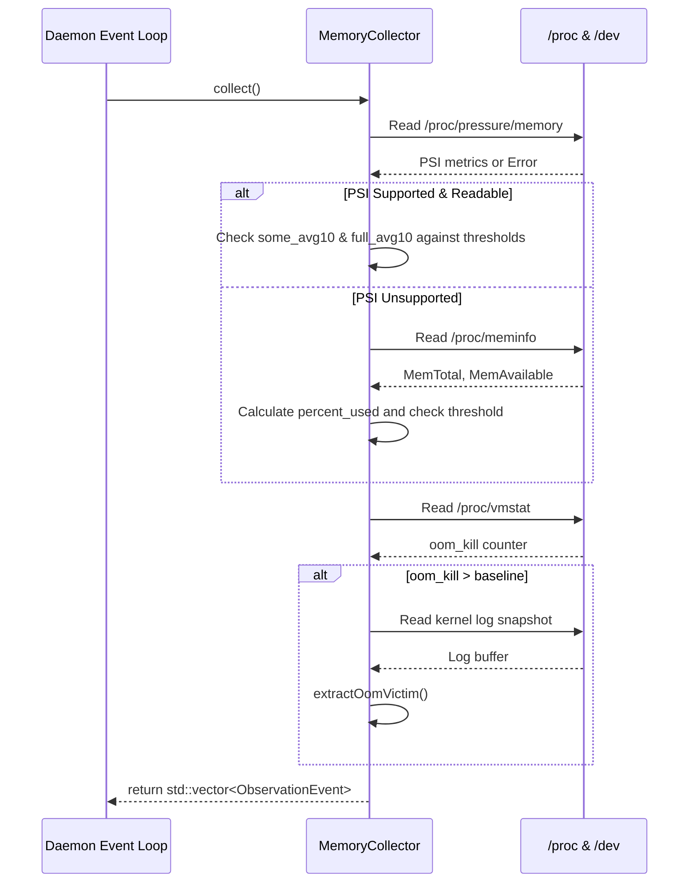

# Architecture Design: Memory & Kernel Collector

**Feature Slug:** `memory-kernel-collector`  
**Component:** `holonightd::MemoryCollector`  
**Project:** holonightd (Linux daemon, C++23)  
**Date:** 2026-08-01  
**Phase:** SDD Stage 2 (Architecture Design)

---

## 1. High-Level Component Architecture & Data Flow

The `MemoryCollector` is an independent, periodic monitoring subsystem within the `holonightd` daemon. It is designed to track memory pressure, general usage, and Out-Of-Memory (OOM) events with minimal overhead. It aligns with the existing collector paradigms (e.g., `StorageCollector`), serving as a producer of `ObservationEvent` payloads.

During a scheduled execution, the `MemoryCollector` performs a non-blocking sequence:
1. **PSI Collection:** Attempts to read `/proc/pressure/memory`. If successful, it checks `some avg10` and `full avg10` percentages against configured thresholds.
2. **Fallback Collection:** If PSI is unavailable, it reads `/proc/meminfo` to calculate classical memory usage percentages.
3. **OOM Tracking:** Reads `/proc/vmstat` to check the `oom_kill` counter. It compares the current value with a baseline stored in the instance state to detect deltas.
4. **Context Extraction:** If an OOM event is detected, it briefly scans a kernel log snapshot (`dmesg` or `/dev/kmsg`) for victim metadata.
5. **Emission:** Compiles generated `ObservationEvent`s and returns them for processing by the daemon's diagnostic pipeline.

### Data Flow Diagram

```mermaid
graph TD
    subgraph Filesystem (procfs / kernel)
        PSI["/proc/pressure/memory"]
        MEMINFO["/proc/meminfo"]
        VMSTAT["/proc/vmstat"]
        KMSG["/dev/kmsg / dmesg"]
    end

    subgraph MemoryCollector
        PSI_Parser["parsePsi()"]
        Meminfo_Parser["parseMeminfo()"]
        VMSTAT_Parser["parseVmstatOom()"]
        KMSG_Parser["extractOomVictim()"]
        Event_Compiler["collect() / collectMetrics()"]
    end

    subgraph Daemon Core
        Event_Bus["Observation Event Store / Logger"]
    end

    PSI -->|Read metrics| PSI_Parser
    PSI_Parser -- Failure --> Meminfo_Parser
    MEMINFO -->|Fallback metrics| Meminfo_Parser
    
    VMSTAT -->|oom_kill counter| VMSTAT_Parser
    VMSTAT_Parser -- If delta > 0 --> KMSG_Parser
    KMSG -->|Victim info| KMSG_Parser
    
    PSI_Parser --> Event_Compiler
    Meminfo_Parser --> Event_Compiler
    KMSG_Parser --> Event_Compiler
    
    Event_Compiler -->|std::vector<ObservationEvent>| Event_Bus
```

---

## 2. Collection Sequence Diagram



---

## 3. Interfaces, Method Signatures & Data Structures

### 3.1. Configuration Extensions (`include/holonightd/Application.h`)
The core `Config` structure will be extended to include `MemoryConfig`:
```cpp
namespace holonightd {
struct MemoryConfig {
  double some_warning_threshold{10.0};
  double full_critical_threshold{25.0};
  double meminfo_warning_threshold{85.0};
};
// Integrated into global Application Config...
}
```

### 3.2. Collector Data Structures (`include/holonightd/MemoryCollector.h`)

```cpp
#pragma once

#include "holonightd/ObservationEvent.h"
#include <filesystem>
#include <optional>
#include <string>
#include <vector>

namespace holonightd {

struct MemoryCollectorOptions {
  double some_warning_threshold{10.0};
  double full_critical_threshold{25.0};
  double meminfo_warning_threshold{85.0};
  
  // Custom proc root for unit testing isolation
  std::filesystem::path proc_root{"/proc"};
};

struct MemoryMetrics {
  // PSI Metrics
  std::optional<double> psi_some_avg10;
  std::optional<double> psi_some_avg60;
  std::optional<double> psi_some_avg300;
  std::optional<double> psi_some_total;
  
  std::optional<double> psi_full_avg10;
  std::optional<double> psi_full_avg60;
  std::optional<double> psi_full_avg300;
  std::optional<double> psi_full_total;

  // Meminfo Metrics
  std::uint64_t total_bytes{0};
  std::uint64_t available_bytes{0};
  std::uint64_t used_bytes{0};
  std::optional<double> percent_used;

  // OOM Metrics
  std::optional<std::uint64_t> oom_kill_counter;
  std::optional<std::uint64_t> oom_kill_delta;
  
  // Victim extraction
  std::optional<pid_t> victim_pid;
  std::optional<std::string> victim_name;

  bool psi_success{true};
  bool meminfo_success{true};
  bool vmstat_success{true};
};

class MemoryCollector {
 public:
  explicit MemoryCollector(MemoryCollectorOptions options = {});

  /// Performs raw metrics collection across memory subsystems.
  [[nodiscard]] MemoryMetrics collectMetrics();

  /// Performs collection and converts threshold violations into observation events.
  [[nodiscard]] std::vector<ObservationEvent> collect();

 private:
  MemoryCollectorOptions options_;
  std::optional<std::uint64_t> baseline_oom_kill_;

  void parsePsi(MemoryMetrics& metrics) const;
  void parseMeminfo(MemoryMetrics& metrics) const;
  void parseVmstatOom(MemoryMetrics& metrics);
  void extractOomVictim(MemoryMetrics& metrics) const;
};

}  // namespace holonightd
```

---

## 4. Key Architectural Decisions & Rationale

1. **Testable `proc_root` Injection:** 
   Hardcoding `/proc` makes tests brittle across different Linux distributions or CI environments. By accepting `proc_root` via `MemoryCollectorOptions`, the unit tests can construct a temporary directory (`/tmp/mock_proc/...`) and simulate various memory pressure, fallback conditions, and VM stat increments securely and deterministically.
   
2. **Stateful `baseline_oom_kill_`:** 
   The `MemoryCollector` maintains internal state across its lifecycle. The first run establishes the baseline (emits no OOM event), and subsequent runs calculate the delta. This avoids alerting on historical OOMs that occurred before the daemon started.

3. **Snapshot Parsing over Continuous Streaming:** 
   Parsing kernel logs for OOM victims is executed purely as a non-blocking synchronous snapshot (e.g., executing `/bin/dmesg | tail -n 50` or non-blocking reads on `/dev/kmsg`). A continuous streaming thread reading `/dev/kmsg` would violate the daemon's zero-overhead, purely periodic design. A snapshot guarantees execution in under 10ms.

4. **Split Metric and Event Generation:** 
   Similar to the `StorageCollector`, splitting `collectMetrics()` from `collect()` allows pure metric observability (useful for diagnostics and debug logging) separate from the event thresholding logic. 

---

## 5. Alternatives Considered & Known Risks

- **System-Wide `/proc/pressure/memory` vs. Cgroup (`memory.pressure`):**
  *Alternative:* Use Cgroup v2 `memory.pressure`. 
  *Rationale:* `holonightd` monitors host-level health rather than application-specific container constraints. Thus, system-wide pressure is prioritized. If container-aware monitoring is required in the future, `proc_root` could be adapted to point to cgroup controllers.
  
- **Continuous Kernel Log Threading:**
  *Alternative:* Use a background thread listening on `/dev/kmsg` to instantly fire events.
  *Rationale:* Rejected. Multi-threading increases synchronization complexity, memory footprint, and risk of blocking the core loop. Polling with snapshots ensures low CPU overhead and deterministic latency, which is acceptable since `holonightd` is a periodic maintainer, not a real-time alerting engine.
  
- **Real `/proc` vs Mocking in Tests:**
  *Alternative:* Do not inject `proc_root`, but run tests conditionally if `/proc` allows it.
  *Rationale:* Rejected. CI runners may not support PSI, or testing an OOM event naturally would kill the test runner. Injecting files via a temporary root is standard practice for Linux tooling tests and satisfies the 100% coverage requirement robustly.
