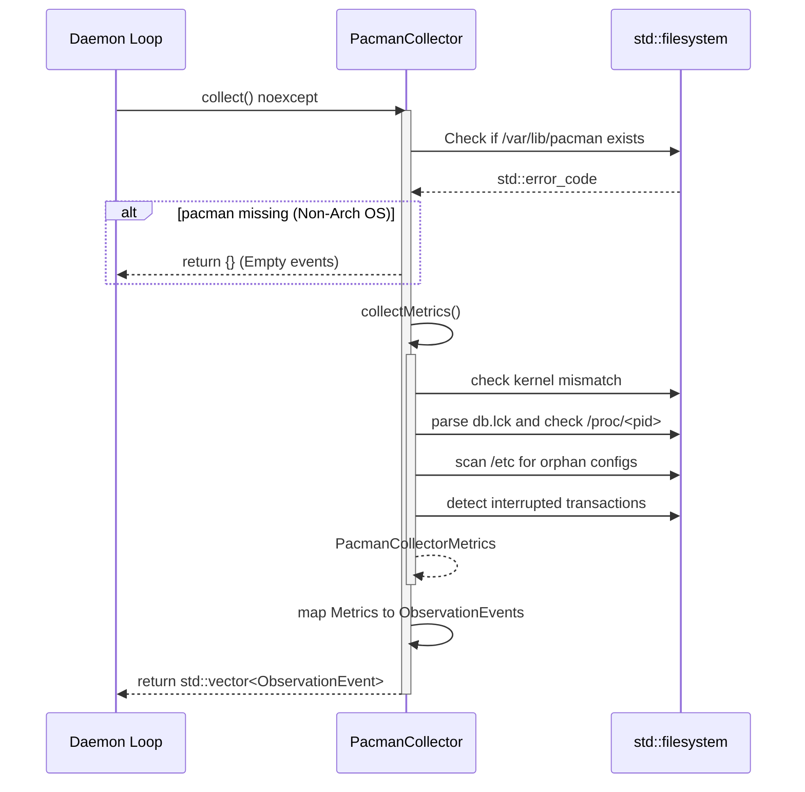

# PacmanCollector — Architectural Design Document

**Component:** `holonightd::PacmanCollector`  
**Project:** holonightd (Linux daemon, C++23)  
**Phase:** SDD Stage 2 (Architecture & Design)

---

## 1. Executive Summary & Architectural Position

The `PacmanCollector` is a specialized telemetry and state-inspection subsystem within the `holonightd` daemon. Positioned alongside existing collectors (e.g., `StorageCollector`, `MemoryCollector`, `SystemdCollector`), it is responsible for autonomously diagnosing package management anomalies on Arch Linux and Arch-derived systems.

Its core responsibilities involve detecting kernel-module inconsistencies, parsing active/stale database locks, locating orphaned configuration artifacts (`.pacnew` / `.pacsave`), and discovering interrupted package transactions.

Architecturally, `PacmanCollector` adheres to a **zero-subprocess, purely filesystem-driven inspection model**. It bypasses `pacman` and shell invocations entirely, instead directly querying the `/proc` filesystem and `/var/lib/pacman/` state files using C++23 `<filesystem>` APIs. This eliminates sub-shell injection risks, sub-process hangs, and execution latency, allowing the daemon to run safely and efficiently.

---

## 2. Component Architecture & Data Flow

### 2.1 Component Architecture Diagram

```mermaid
graph TD
    subgraph holonightd daemon
        subgraph Collectors
            PC[PacmanCollector]
            SC[StorageCollector]
            MC[MemoryCollector]
        end
        EventBus[Diagnostic Event Bus]
    end

    subgraph OS Filesystem
        ProcFS[/proc]
        VarLibPacman[/var/lib/pacman/]
        UsrLibModules[/usr/lib/modules/]
        EtcFS[/etc/]
    end

    PC -->|Read lock & state| VarLibPacman
    PC -->|Check running kernel / PIDs| ProcFS
    PC -->|Check module directories| UsrLibModules
    PC -->|Scan .pacnew / .pacsave| EtcFS

    PC -.->|Emits std::vector<ObservationEvent>| EventBus
```

### 2.2 Execution Sequence Diagram



---

## 3. Class Interfaces & Data Structures

### 3.1 Data Structures

```cpp
#pragma once

#include "holonightd/ObservationEvent.h"
#include <filesystem>
#include <string>
#include <vector>
#include <cstdint>
#include <optional>

namespace holonightd {

struct PacmanCollectorOptions {
    std::filesystem::path sys_root = "/";
    std::filesystem::path db_path = "var/lib/pacman"; // relative to sys_root
    std::filesystem::path etc_path = "etc";           // relative to sys_root
    
    unsigned int max_depth = 3;
    unsigned int warning_threshold = 5;
    
    bool check_kernel = true;
    bool check_locks = true;
    bool check_orphans = true;
    bool check_transactions = true;
};

struct PacmanCollectorMetrics {
    // Kernel metrics
    std::optional<std::string> running_kernel;
    bool kernel_mismatch_detected = false;
    std::vector<std::string> installed_modules_dirs;
    std::vector<std::string> installed_kernel_packages;

    // Lock metrics
    struct LockState {
        bool exists = false;
        std::optional<pid_t> pid;
        bool is_active = false;
        std::optional<std::string> process_name;
        std::optional<uint64_t> lock_age_seconds;
        std::string invalid_reason; // e.g. "invalid_pid", "process_dead"
    } lock;

    // Orphan config metrics
    int64_t pacnew_count = 0;
    int64_t pacsave_count = 0;
    std::vector<std::string> orphan_files;

    // Transaction metrics
    bool interrupted_transaction_detected = false;
    std::vector<std::string> transaction_artifacts;
};

} // namespace holonightd
```

### 3.2 Class Declaration

```cpp
namespace holonightd {

class PacmanCollector {
public:
    explicit PacmanCollector(PacmanCollectorOptions options = {});

    /// Gathers all pacman diagnostic states and returns a list of ObservationEvents.
    /// Guaranteed not to throw.
    [[nodiscard]] std::vector<ObservationEvent> collect() const noexcept;

    /// Internal method to gather raw metrics before event mapping.
    [[nodiscard]] PacmanCollectorMetrics collectMetrics() const;

private:
    PacmanCollectorOptions options_;
    
    // Sub-algorithms
    void evaluateKernelState(PacmanCollectorMetrics& metrics) const;
    void evaluateLockState(PacmanCollectorMetrics& metrics) const;
    void evaluateOrphanConfigs(PacmanCollectorMetrics& metrics) const;
    void evaluateTransactions(PacmanCollectorMetrics& metrics) const;
};

} // namespace holonightd
```

---

## 4. Algorithmic Breakdown

### 4.1 Kernel Mismatch Detection
1. **Running Kernel Resolution:** Parse `/proc/version` or `uname` via `/proc/sys/kernel/osrelease` (relative to `sys_root`) to get the running kernel release string (e.g., `6.4.12-arch1-1`).
2. **Modules Check:** Inspect `sys_root / "usr/lib/modules/"` and look for a directory matching the running release.
3. **Local DB Check:** Iterate over `sys_root / "var/lib/pacman/local/"` looking for directories starting with `linux-`.
4. **Mismatch Logic:** If the running release directory is absent in `/usr/lib/modules/` or missing from the local package database, flag `kernel_mismatch_detected = true`.

### 4.2 Lock State Evaluation
1. **Lock File Existence:** Check if `sys_root / db_path / "db.lck"` exists.
2. **PID Parsing:** Open `db.lck` and read its string content. Attempt to parse it to a `pid_t`. If parsing fails, flag as `invalid_pid`.
3. **Process Liveness Verification:** 
   - Check if `sys_root / "proc" / to_string(pid)` is a valid directory.
   - If yes, read `sys_root / "proc" / to_string(pid) / "comm"` to extract the process name. Flag as `is_active = true`.
   - If no, flag as `process_dead`.
4. **Lock Age:** Stat the file to determine the modification time relative to current system time.

### 4.3 Orphan Config Scanner (`.pacnew` / `.pacsave`)
1. **Recursive Iterator:** Initialize `std::filesystem::recursive_directory_iterator` at `sys_root / etc_path`.
2. **Options:** Use `std::filesystem::directory_options::skip_permission_denied` and optionally `follow_directory_symlink`. Keep track of depth using `iterator.depth()`.
3. **Depth Limiting:** If `iterator.depth() >= max_depth`, call `iterator.disable_recursion_pending()`.
4. **Matching:** For regular files, check if the string representation of the path ends with `.pacnew` or `.pacsave`. Increment counters and store relative paths.

### 4.4 Interrupted Transaction Checker
1. **Scan Local DB:** Look inside `sys_root / db_path / "local"`.
2. **Detect Artifacts:** Identify package directories ending in `.tmp` or containing lock files aside from `db.lck`.
3. **Flagging:** If such artifacts exist, flag `interrupted_transaction_detected = true` and record the suspicious paths.

---

## 5. Error Handling & Exception Safety

- **`noexcept` Guarantee:** The public `collect() const noexcept` signature guarantees the collector will not crash the daemon under any filesystem anomaly.
- **`std::error_code` Overloads:** All `<filesystem>` operations (e.g., `exists`, `is_directory`, `status`, `recursive_directory_iterator` creation) must use the standard library overloads that accept an `std::error_code&` reference instead of throwing `std::filesystem_error`.
- **Stream Operations:** Standard `std::ifstream` is used for reading `/proc` and lock files. Read failures (e.g., missing permissions, concurrent file deletion) will safely evaluate to `false` (via `.fail()`), resulting in graceful fallback behaviors.
- **Non-Arch Linux OS Handling:** If `sys_root / db_path` is not a directory or is inaccessible, the collector immediately exits its metric collection phase and returns an empty `std::vector<ObservationEvent>`. Spurious warning events will not be emitted on non-Arch systems.

---

## 6. Architectural Decisions & Trade-offs

| Decision | Rationale | Trade-offs |
|---|---|---|
| **Zero Subprocesses** | Spawning `pacman` via sub-shell introduces latency, sub-process lifecycle risks, and security considerations. Direct file reading is deterministic and extremely fast. | Reimplementing standard pacman logic implies minor coupling to pacman's internal directory structure. However, pacman's state file format is highly stable. |
| **`sys_root` Abstraction** | Facilitates mock testing. A `PacmanCollector` instantiated with `sys_root = "/tmp/mock_root"` can be rigorously unit tested without mocking POSIX functions. | Requires diligent path concatenation in every filesystem operation to prevent logic leaks to the host root. |
| **Bounded `etc` Scanning** | Recursive directory scanning can trigger unbounded depth on cyclic symlinks or cause I/O latency spikes. Limiting `max_depth` to 3 bounds execution time. | May miss `.pacnew` files deeply nested inside `/etc` (though highly uncommon). |

---

## 7. Alternatives Considered & Known Risks

### Alternatives Considered
1. **Using `libalpm` directly:**
   - *Why rejected:* Linking against `libalpm` would require a hard dependency on pacman headers and libraries, violating the daemon's zero-dependency philosophy. Furthermore, `libalpm` is not exception-safe by default.
2. **Periodic Subprocess Invocation (`system()`)**:
   - *Why rejected:* Unsafe, blocking, requires shell invocation, and heavily discouraged in the project guidelines.

### Known Risks
- **Race Conditions:** Checking `/proc/<pid>` after reading `db.lck` is intrinsically subject to a TOCTOU race condition. A process could die in the milliseconds between reading the PID and stat-ing the `/proc` directory. This is acceptable for a telemetry diagnostic tool.
- **Pacman Upgrades:** If a future version of pacman drastically changes how the local database is structured, the collector will need to be updated. Historical stability makes this risk low.
