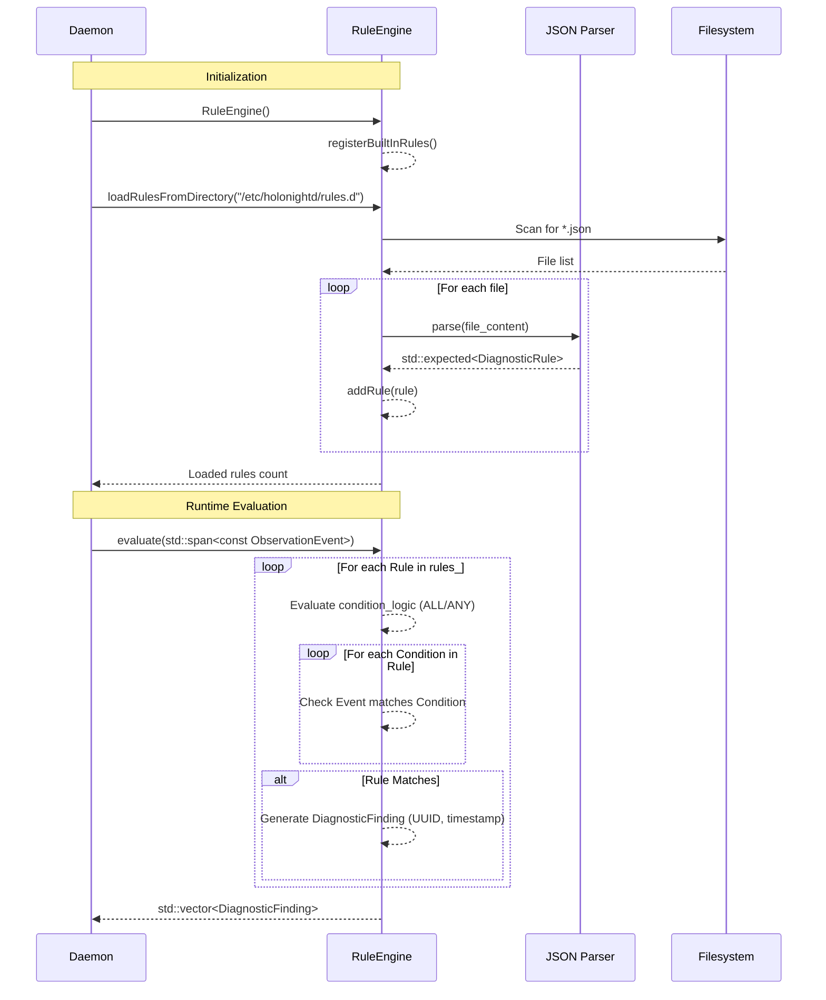

# RuleEngine — Architectural Design Document

## 1. Executive Summary & Architectural Position

The `RuleEngine` is a core component of the `holonightd` diagnostic pipeline (Phase 1.2). Its primary role is to act as a declarative knowledge base and deterministic evaluation engine. It takes streams of raw `ObservationEvent` objects—generated by system collectors—and pattern-matches them against a set of `DiagnosticRule` objects. When a match occurs, the engine yields a `DiagnosticFinding` which encapsulates the root cause and suggests actionable remediation steps.

Architecturally, the `RuleEngine` sits between the event ingestion/collection layer and the reporting/LLM layer. It is a stateless, pure in-memory evaluation function: it does not query databases, execute subprocesses, or apply remediation directly. This enforces strict separation of concerns, ensuring high performance, deterministic behavior, and safe execution within the daemon's main loop.

## 2. Component Architecture & Data Flow

### 2.1 System Context Diagram

```mermaid
graph TD
    subgraph Collectors
        K[Kernel Collector]
        P[Pacman Collector]
        S[Storage Collector]
        M[Memory Collector]
        U[Systemd Collector]
    end

    subgraph Data Layer
        E[Observation Events]
    end

    subgraph Rule Engine Layer
        JSON[JSON Rule Files] -->|Parsed via nlohmann/json| RE[RuleEngine]
        BI[Built-in Rules] --> RE
        E -->|span<const ObservationEvent>| RE
        RE -->|evaluate()| DF[DiagnosticFindings]
    end

    subgraph Action/Reporting Layer
        DF --> LLM[LLM Summarizer / Reporter]
        DF --> DB[EventStore / Log]
    end

    K --> E
    P --> E
    S --> E
    M --> E
    U --> E
```

### 2.2 Evaluation Sequence



## 3. Class Interfaces & Data Structures

The data structures are designed using C++23 standards, leveraging `std::optional` for flexible matching and explicit enums for deterministic state.

```cpp
namespace holonightd {

enum class MatchOperator {
    Equals,
    NotEquals,
    GreaterThan,
    GreaterThanOrEqual,
    LessThan,
    LessThanOrEqual,
    Contains,
    Regex
};

enum class LogicOperator {
    All, // All conditions must match at least one event
    Any  // At least one condition must match at least one event
};

struct RuleCondition {
    std::optional<std::string> source;
    std::optional<std::string> category;
    std::optional<std::string> subject;
    std::optional<std::string> signal;
    std::optional<Severity> min_severity;
    std::optional<std::string> target_value;
    MatchOperator value_operator{MatchOperator::Equals};
};

struct DiagnosticRule {
    std::string rule_id;
    std::string title;
    std::string category;
    Severity severity{Severity::Warning};
    LogicOperator condition_logic{LogicOperator::All};
    std::vector<RuleCondition> conditions;
    std::vector<std::string> candidate_causes;
    std::vector<std::string> suggested_actions;
};

struct DiagnosticFinding {
    std::string finding_id;
    std::string rule_id;
    std::string title;
    std::string category;
    Severity severity{Severity::Warning};
    std::vector<ObservationEvent> matched_events;
    std::vector<std::string> candidate_causes;
    std::vector<std::string> suggested_actions;
    std::string timestamp; // ISO-8601
};

class RuleEngine {
public:
    RuleEngine();
    
    void addRule(DiagnosticRule rule);
    
    static std::expected<DiagnosticRule, std::string> loadRuleFromJson(const std::string& json_str);
    static std::expected<DiagnosticRule, std::string> loadRuleFromFile(const std::filesystem::path& file_path);
    size_t loadRulesFromDirectory(const std::filesystem::path& dir_path);

    [[nodiscard]] const std::vector<DiagnosticRule>& getRules() const noexcept { return rules_; }
    void clearRules() noexcept { rules_.clear(); }

    [[nodiscard]] std::vector<DiagnosticFinding> evaluate(std::span<const ObservationEvent> events) const noexcept;

private:
    std::vector<DiagnosticRule> rules_;
    void registerBuiltInRules();
};

} // namespace holonightd
```

## 4. Algorithmic Breakdown

### 4.1 Rule Evaluation Loop (ALL vs ANY)

The `evaluate()` method uses a nested loop design optimized for fast in-memory execution:

1. **Outer Loop**: Iterate through all registered `DiagnosticRule`s.
2. **Finding State Tracking**: For each rule, maintain a boolean `rule_matched` and an accumulator `std::vector<ObservationEvent> matched_events`.
3. **Inner Loop**: Iterate through all `RuleCondition`s within the rule.
4. **Event Matching**: For each condition, iterate through `std::span<const ObservationEvent> events`. A condition is "satisfied" if it matches *at least one* event.
   - If `LogicOperator::All` is set: If *any* condition fails to match at least one event, the rule fails. Bail out early.
   - If `LogicOperator::Any` is set: If *any* condition matches an event, the rule succeeds. Continue evaluating remaining conditions just to collect all matching events.
5. **Yielding**: If the rule logic is satisfied, construct a `DiagnosticFinding` and append it to the result vector.

### 4.2 Value Comparison Matching

When evaluating a `RuleCondition` against an `ObservationEvent`, filtering checks are applied to `source`, `category`, `subject`, `signal`, and `min_severity`. 
If `target_value` is set, `MatchOperator` logic is applied against the event's equivalent data:
- **String metrics**: Checked against `Equals`, `NotEquals`, `Contains`, or `Regex` (`std::regex` with caching).
- **Numeric metrics**: Converted via `std::stod` or `std::stoll` for `GreaterThan`, `LessThan`, etc. If conversion fails, the condition fails safely.

### 4.3 Timestamp and ID Generation

When a `DiagnosticFinding` is generated:
- `timestamp`: Acquired using `std::chrono::system_clock::now()` and formatted to ISO-8601 string via `std::format` or `<chrono>` utilities.
- `finding_id`: A UUID string generated using a lightweight internal UUIDv4 generator (or system UUID library if available without massive dependencies) to ensure uniqueness across daemon restarts.

### 4.4 Built-in Rules Pipeline

`RuleEngine()` invokes `registerBuiltInRules()`, which pushes predefined `DiagnosticRule` objects directly into the `rules_` vector. These include:
- `RULE-KERNEL-001` (Kernel Version Mismatch)
- `RULE-PACMAN-001` (Stale Pacman Lock)
- `RULE-STORAGE-001` (Space/Inode Pressure)
- `RULE-MEMORY-001` (OOM/Swap)
- `RULE-SYSTEMD-001` (Systemd Unit Failure)

## 5. Error Handling & Exception Safety

- **Non-throwing Execution (`evaluate`)**: Marked `noexcept`. All standard library allocations (e.g., `std::vector::push_back`) are assumed to succeed or terminate (standard C++ behavior for bad_alloc in critical embedded systems). Regex parsing errors during evaluation are caught internally; invalid regexes fail gracefully without crashing the loop.
- **`std::expected` for JSON Ingestion**: `loadRuleFromJson` uses `nlohmann::json` which throws exceptions on parse failures. These exceptions are caught inside the ingestion methods and converted to a detailed `std::expected<..., std::string>` containing the error line/column and missing keys.
- **Directory Traversal**: `loadRulesFromDirectory` uses `std::filesystem::directory_iterator`. `std::error_code` overloads are utilized to prevent throwing exceptions on permission denied errors; failed files are simply logged and skipped.

## 6. Architectural Decisions & Trade-offs

| Decision | Rationale | Trade-off / Implication |
| :--- | :--- | :--- |
| **In-Memory Evaluation over SQL Queries** | SQLite queries against the EventStore per rule would introduce latency and locking overhead. In-memory `std::span` iteration is sub-millisecond. | Cannot query historical events outside the provided `span`. Relegates historical analysis to a different component. |
| **Zero Subprocess Execution** | `RuleEngine` must be safe. Executing shell scripts based on matching rules introduces severe security vectors and blocks the main thread. | Remediation must be handled downstream. `RuleEngine` merely suggests `action_id` strings. |
| **JSON Schema for Rules** | JSON is widely understood and supported by robust C++ libraries (`nlohmann`). | Slightly more verbose than YAML/TOML, but avoids adding more dependencies just for rule parsing. |

## 7. Alternatives Considered & Known Risks

- **Alternative 1: Lua / Embedded Scripting Rules**: We considered using Lua (via sol2) or Python for rule evaluation. This was rejected because it violates the "Zero GUI/Qt Dependencies" and minimal runtime overhead philosophy. It would drastically increase binary size and memory footprint.
- **Alternative 2: Prolog / Rete Algorithm Engine**: Implementing a full forward-chaining Rete network was deemed overkill for Phase 1. A simple linear pass of `M` rules against `N` events is easily fast enough ($O(M \times N)$) given $N < 10,000$.
- **Known Risk - Regex Performance**: Permitting `Regex` match operators could lead to ReDoS (Regular expression Denial of Service) if user-provided rules are poorly written. **Mitigation**: Limit regex usage in default rules and document the performance implications for custom rules. Regexes should be compiled once at ingestion time, not evaluation time.
