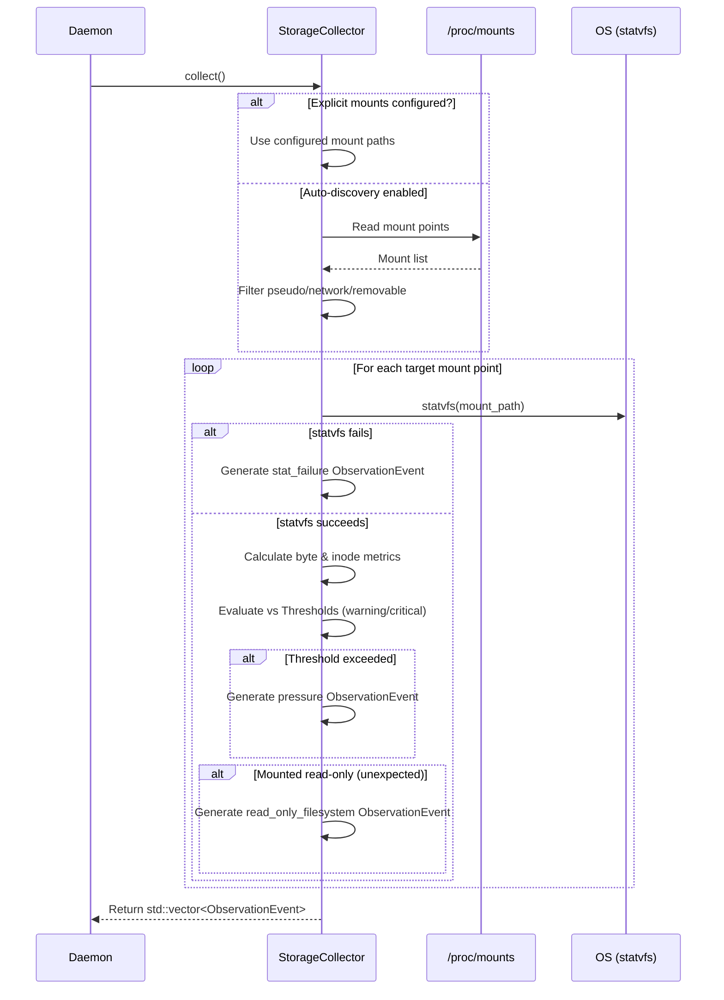

# Storage Collector — Architecture & Design

**Feature Slug:** `storage-collector`  
**Component:** `holonightd::StorageCollector`  
**Phase:** SDD Stage 2 (Design)

---

## 1. System Architecture & Data Flow

The `StorageCollector` acts as a discrete diagnostic module within the `holonightd` daemon. It performs active sampling of the system's storage stack, interacting directly with procfs and the POSIX `statvfs` API to retrieve capacity and inode metrics. The emitted `ObservationEvent` payloads are routed to the central `EventStore`.

### 1.1 Component Interaction Diagram

```mermaid
graph TD
    Config(holonightd.toml) -->|Configuration| Daemon
    Daemon -->|Initialization| SC[StorageCollector]
    SC -->|Parses| ProcMounts[/proc/mounts]
    SC -->|System Call| Statvfs[statvfs]
    SC -->|Returns| ObsList[std::vector<ObservationEvent>]
    Daemon -->|Persists| ES[EventStore]
    ObsList -.-> ES
```

### 1.2 Scan Execution Sequence



---

## 2. Class & Interface Definitions

The component is defined within the `holonightd` namespace and embraces C++23 idioms such as `std::expected` (where applicable) and `std::vector` for returning payloads.

### 2.1 StorageCollectorOptions

```cpp
namespace holonightd {

struct StorageCollectorOptions {
  double warning_threshold{85.0};
  double critical_threshold{95.0};
  bool auto_discover{true};
  std::vector<std::filesystem::path> mount_points;
};

} // namespace holonightd
```

### 2.2 StorageCollector Class

```cpp
namespace holonightd {

struct MountInfo {
  std::filesystem::path mount_path;
  std::string device_node;
  std::string fstype;
  std::string options;
};

class StorageCollector {
 public:
  explicit StorageCollector(StorageCollectorOptions options);

  /// Performs the storage metric collection across targeted mount points.
  /// Does not throw exceptions on standard filesystem or I/O errors.
  [[nodiscard]] std::vector<ObservationEvent> collect() const;

 private:
  /// Discovers local physical mount points by reading /proc/mounts
  [[nodiscard]] static std::vector<MountInfo> discoverMounts();

  /// Inspects a single mount point via statvfs and optionally yields events
  [[nodiscard]] std::vector<ObservationEvent> inspectMount(const MountInfo& info) const;

  StorageCollectorOptions options_;
};

} // namespace holonightd
```

---

## 3. Metric Calculations

When a mount point is inspected, the POSIX `statvfs` structure provides block and inode counts. Metric percentages are calculated as follows (yielding `double` precision values):

- **Byte Percentage:**  
  `((total_bytes - available_bytes) / total_bytes) * 100.0`  
  *Where:*  
  - `total_bytes` = `f_blocks * f_frsize`  
  - `available_bytes` = `f_bavail * f_frsize`  
  *(Note: using `f_bavail` instead of `f_ffree` takes root-reserved blocks into account when calculating user-available capacity).*

- **Inode Percentage:**  
  `((total_inodes - free_inodes) / total_inodes) * 100.0`  
  *Where:*  
  - `total_inodes` = `f_files`  
  - `free_inodes` = `f_ffree`

---

## 4. ObservationEvent Payload Mapping

Events generated by the collector are mapped onto the central `ObservationEvent` structure.

- **`source`**: `"storage_collector"`
- **`category`**: `"storage"`
- **`subject`**: The absolute mount path (e.g., `"/"`, `"/mnt/data"`).

### 4.1 Signals

- **`space_pressure`**: Emitted when byte usage percentage >= `warning_threshold`. Value holds the byte percentage as a `double`.
- **`inode_pressure`**: Emitted when inode usage percentage >= `warning_threshold`. Value holds the inode percentage as a `double`.
- **`read_only_filesystem`**: Emitted when a physical writeable mount point is surprisingly found in a read-only state (e.g., kernel remounts due to I/O error). Value is `std::monostate`.
- **`stat_failure`**: Emitted when `statvfs` fails on the target path. Value is `std::monostate`.

### 4.2 Attributes JSON Structure

All successful storage events populate the `attributes` JSON field with a stringified JSON object containing extended context:

```json
{
  "total_bytes": 1000000000,
  "used_bytes": 850000000,
  "available_bytes": 150000000,
  "total_inodes": 500000,
  "used_inodes": 100000,
  "free_inodes": 400000,
  "fstype": "ext4",
  "mount_flags": "rw,relatime"
}
```

---

## 5. Error Handling & Robustness

The `StorageCollector` is designed to be highly resilient against filesystem anomalies:

1. **No Unhandled Exceptions**: 
   Standard I/O failures (e.g., `/proc/mounts` unavailable, missing mount points) or `statvfs` system call failures (`EACCES`, `ENOENT`, `EIO`) are caught or translated into `stat_failure` `ObservationEvent` payloads. The `collect()` method is conceptually exception-safe regarding filesystem state.
2. **Non-Blocking Operation**:
   Network filesystems (NFS, SMB) and dynamic media are explicitly filtered out during auto-discovery to prevent `statvfs` from hanging indefinitely if a network share goes offline.

---

## 6. Trade-offs, Risk Analysis & Alternatives Considered

- **`statvfs` vs `/sys/fs` scraping**: 
  We chose `statvfs` as it is the standard POSIX interface for querying filesystem capacity, whereas `/sys/fs` structures vary wildly between filesystem drivers (BTRFS vs Ext4). `statvfs` provides a uniform abstraction, though it can block on dead network shares (mitigated by our strict filtering).
- **Auto-discovery vs Hardcoded mounts**:
  Reading `/proc/mounts` introduces string parsing overhead but makes the daemon zero-conf for standard deployments. Hardcoding requires manual intervention. Supporting both (auto-discovery with an explicit override in configuration) provides the best balance of flexibility and ease-of-use.
- **Why not use `std::filesystem::space`?**
  `std::filesystem::space_info` only provides byte-level capacity (capacity, free, available). It does not provide inode exhaustion metrics, which are critical for Linux server health monitoring. `statvfs` provides both byte and inode metrics in a single system call.
