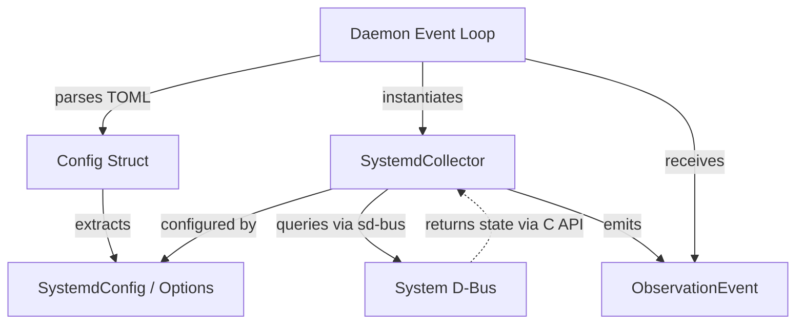
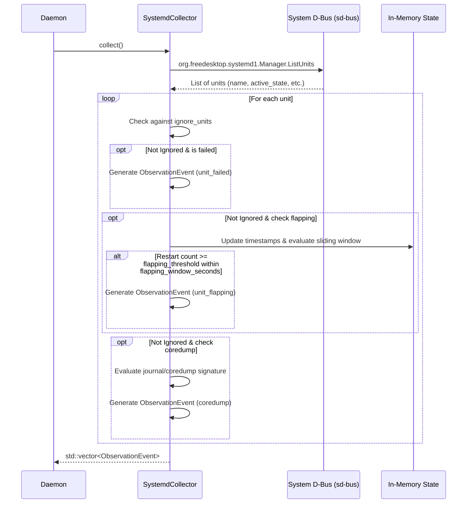

# Systemd Collector Architecture Design

**Feature ID:** `systemd-collector`  
**Project:** holonightd (Linux daemon, C++23)  
**Date:** 2026-08-01

---

## 1. High-Level Component Architecture & Data Flow

The `SystemdCollector` integrates into the `holonightd` architecture as an independent metric and event collector, analogous to the `StorageCollector`. It interfaces directly with the `Config` structures loaded by the application and feeds `ObservationEvent` instances to the central `Daemon` event loop.

### Data Flow
1. **Configuration**: The `Daemon` loads `holonightd.toml` into a `Config` structure, which now includes a `SystemdConfig` block.
2. **Initialization**: The `Daemon` instantiates `SystemdCollector`, passing it `SystemdCollectorOptions` mapped from the configuration.
3. **Collection**: On each tick interval, `SystemdCollector::collect()` is called.
4. **D-Bus Query**: The collector connects to `org.freedesktop.systemd1` over the system D-Bus using `sd-bus` and issues a `ListUnits` call to gather the states of all active and failed units.
5. **State Processing**: The collector evaluates current states, checks unit restart times against a sliding window (for flapping), and detects coredumps.
6. **Event Generation**: Filtered unit failures, flapping anomalies, and coredumps are transformed into `ObservationEvent` vectors and returned to the `Daemon` for persistence and LLM summarization.

---

## 2. Mermaid Diagrams

### Component Architecture



### Collection Sequence Diagram



---

## 3. Interfaces, APIs, and Data Structures

### Configuration Extensions (Application.h)

To support the collector, the main application configuration will be extended:

```cpp
namespace holonightd {

struct SystemdConfig {
  int flapping_threshold{3};
  int flapping_window_seconds{300};
  std::vector<std::string> ignore_units;
};

struct Config {
  // Existing fields...
  std::chrono::seconds interval{300};
  
  // New Systemd Collector Config
  SystemdConfig systemd;
};

}
```

### Collector Options & In-Memory State

```cpp
namespace holonightd {

struct SystemdCollectorOptions {
  int flapping_threshold{3};
  int flapping_window_seconds{300};
  std::vector<std::string> ignore_units;
};

// Tracks unit restart events for flapping detection
struct UnitFlappingState {
  // Circular buffer or vector of timestamps of recent starts/restarts
  std::vector<std::chrono::system_clock::time_point> recent_starts;
};

class SystemdCollector {
 public:
  explicit SystemdCollector(SystemdCollectorOptions options = {});

  [[nodiscard]] std::vector<ObservationEvent> collect();

 private:
  SystemdCollectorOptions options_;
  std::unordered_map<std::string, UnitFlappingState> flapping_state_;
  
  // Internal helper for garbage collecting old timestamps
  void pruneOldTimestamps(const std::chrono::system_clock::time_point& now);
};

}
```

---

## 4. Key Architectural Decisions and Trade-offs

### 1. D-Bus Interface: `sd-bus` C API vs. `sdbus-c++` Wrapper vs. Shell
- **Decision:** Use the low-level `sd-bus` C API (provided by `libsystemd`).
- **Trade-off:** Writing RAII wrappers around C APIs (`sd_bus`, `sd_bus_message`, `sd_bus_error`) requires careful memory management. However, it avoids bringing in heavy third-party C++ wrappers (`sdbus-c++`), maintaining the project's zero external heavy dependency ethos. Shell execution (`systemctl`) is explicitly forbidden by constraints for performance and safety reasons.

### 2. Flapping State: In-Memory vs. Persistent Tracking
- **Decision:** In-memory tracking within the `SystemdCollector` class instance.
- **Trade-off:** Restart times and flapping state are lost if `holonightd` restarts. However, the sliding window is short (default 5 minutes), making the temporary loss acceptable. This avoids the high I/O latency and schema complexity of tracking unit starts in the SQLite database, ensuring the scan stays strictly under the 500ms latency requirement.

### 3. Non-Blocking Error Handling and Fallbacks
- **Decision:** Graceful degradation on D-Bus connection failure.
- **Trade-off:** In environments lacking `systemd` or D-Bus (e.g., lightweight containers, chroots), the collector handles the `sd_bus_open_system` failure by logging a warning and returning an empty vector rather than throwing an exception. This guarantees the daemon remains robust and operational across heterogeneous linux topologies. Timeouts on D-Bus queries will be strictly enforced to prevent main loop stalling.

---

## 5. Alternatives Considered & Known Risks

### Alternatives Considered
- **Shell Out (`systemctl show / is-failed`)**: Easiest to implement, but fork/exec overhead per scan is too high, scaling poorly with hundreds of units. Explicitly rejected by REQ-C-002.
- **Journalctl Polling**: Tailing the systemd journal for failure events. Rejected because maintaining cursor state adds unnecessary complexity compared to directly requesting current state vectors via `ListUnits`.

### Known Risks
- **Unbounded State Growth:** A misbehaving system with thousands of rapidly churning short-lived units could bloat `flapping_state_` memory. 
  - *Mitigation:* The `collect()` method will prune timestamps outside the sliding window and remove map entries when their vectors become empty.
- **Main Loop Blocking:** Synchronous D-Bus method calls (`sd_bus_call`) block the calling thread. If `systemd` PID 1 is deadlocked or highly stressed, it could delay `holonightd`.
  - *Mitigation:* Use explicit timeouts (e.g., 200ms) on all `sd_bus_call` invocations rather than relying on default timeouts.
